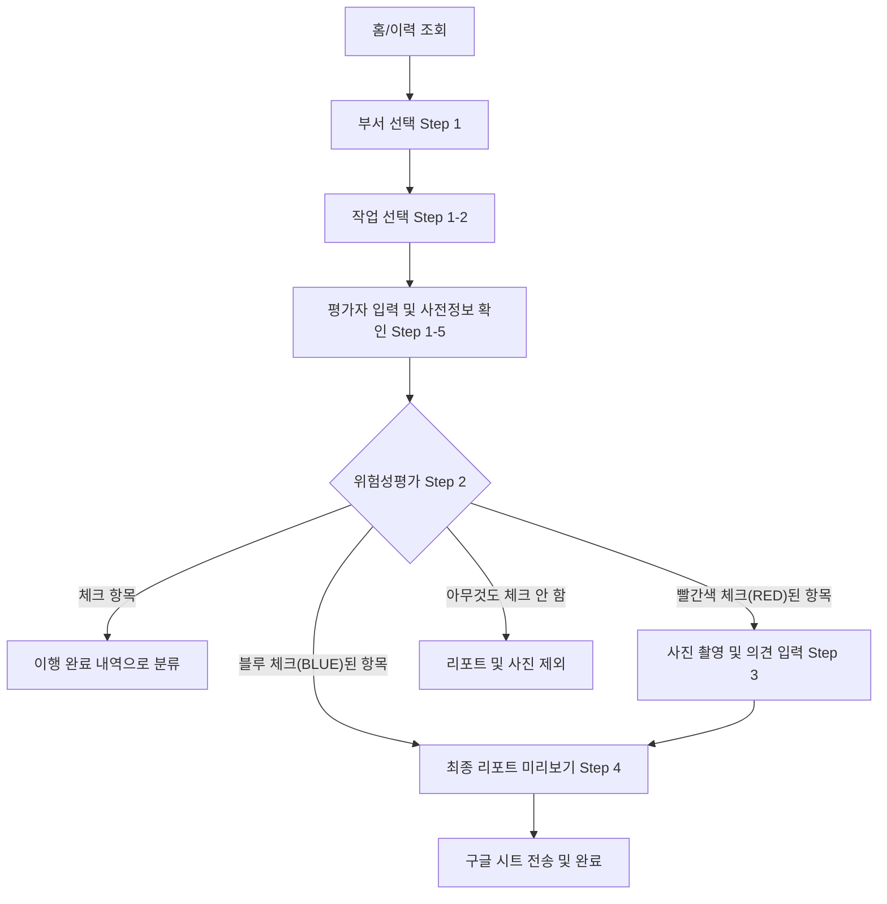

# 🗺 KOMIPO 스마트 안전 시스템 로직 지도 (v35.7.1)

본 문서는 시스템의 동작 원리와 데이터의 흐름을 정의합니다. 안티그래비티는 코드를 수정할 때 본 도면의 흐름에서 벗어나지 않도록 주의해야 합니다.

---

## 1. 전체 프로세스 흐름 (Main Workflow)

---

## 2. 핵심 비즈니스 로직 (Core Logic)

### 2.0 사전 정보 검색 엔진 (v35.7.5)
- **Fuzzy Matching 4단계**:
  1. **Strict**: 부서명 + 작업명이 정규화 후 완벽 일치.
  2. **Global Task**: 부서와 관계 없이 동일한 작업명이 존재하면 해당 정보 활용.
  3. **Similarity Engine (v35.7.5)**: 레벤슈타인 거리(Levenshtein) 알고리즘을 통해 '도입관' vs '도압관'과 같은 오타/유사어 매칭. (일치율 60% 이상 시 채택)
  4. **Keyword**: '전기', '고소' 등 핵심 키워드 감지 시 고정 표준 가이드 출력.
- **Unified State Sync (Flow-Locked)**: `syncUIState()`를 통해 작업 선택 화면에서는 부서명만, 그 외 단계에서는 전체 경로를 강제 노출.

- **Fill-Down 엔진**: 비어있는 [부서명, 작업명, 작업단계] 필드를 상단 행의 값으로 자동 채움.

- **평가자(Worker) 관리**: 다수의 평가자를 입력받아 `currentState.selectedWorkers` 배열로 저장. 제출 시 쉼표(,)로 구분된 문자열로 전송.
- **사전 정보 로드 (PRE_INFO_DATA)**: `위험성평가사전정보.csv` 추출 데이터를 기반으로 [사용공구, 관련자료, 보호구] 정보를 노출.

### 2.1 엄격한 필터링 및 데이터 전이 (v35.6.1)
- **Step 3 (개선 조치) 노출 조건**: Step 2에서 **빨간색 체크박스(추가 개선대책)**를 선택한 항목만 선별 노출. 단순히 파란색 체크를 안 한 항목(방치)은 사진 촬영 대상에서 제외됨.
- **Step 4 (최종 미리보기) 노출 조건**: 
  1. 부서/작업에 해당하는 전체 데이터가 아닌, **사용자가 최소 하나라도 체크(Blue or Red)한 위험항목**만 카드 형태로 렌더링.
  2. 카드 내부에는 **실제로 체크된 안전조치/개선대책 텍스트만** 표시하며, 미이행 혹은 공란은 완전히 숨김.
- **데이터 결합**: 제출 시 `implementedList`(이행)와 `improvementList`(개선 확정) 데이터를 기반으로 최종 리포트 생성.

### 2.2 실시간 위험도 계산 (Risk Assessment)
- **공식**: $R$ (위험도) = $L$ (빈도) $\times$ $S$ (강도)
- **범위**: $L(1\sim5)$, $S(1\sim5) \Rightarrow R(1\sim25)$
- **유형**: '현재 위험성'과 '개선 후 위험성' 두 가지 상태를 독립적으로 관리함.

### 2.3 데이터 영속성 (Data Persistence)
- **LocalStorage**: 단계 전환 시마다 `saveDraft()`를 호출하여 브라우저 종료 시에도 데이터 보존.
- **Google Sheets**: "위험성평가실시" 시트를 타겟으로 하며, 최종 제출 시에만 API 통신 발생.

---

## 3. 데이터 송신 규격 (Payload Spec)

| 항목 | 설명 | 매핑 시트 컬럼 (예상) |
| :--- | :--- | :--- |
| `department` | 선택된 부서명 | 부서명 |
| `task` | 선택된 작업명 | 작업명 |
| `worker` | 참여자 명단 (CSV 형태) | 평가참여자 |
| `improvement_photo` | 보완 조치 사진 (Base64) | 개선조치사진 |
| `signature` | 최종 서명 이미지 (Base64) | 서명 |

---
**※ 본 로직 지도는 시스템의 '생각하는 방식'을 결정합니다. 로직 변경 시 반드시 이 지도를 먼저 업데이트해야 합니다.**
